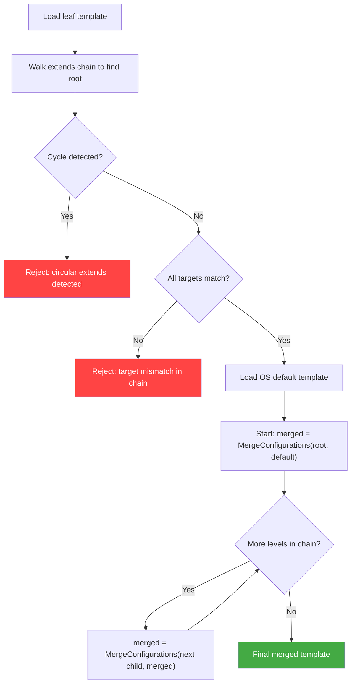

# ADR: Extending Templates

**Status**: Proposed
**Date**: 2026-05-26
**Updated**: 2026-05-30
**Authors**: ICT Team
**Technical Area**: Template Configuration / Merge System

---

## Summary

Add an optional `extends` field to user templates, enabling linear inheritance chains. Each template may extend at most one parent template. The merge is applied iteratively from the root of the chain through each level, producing a deterministic result. This allows users to maintain minimal delta templates that automatically inherit updates from their parent templates.

---

## Context

### Problem Statement

Teams often publish reusable templates (e.g., `ubuntu24-x86_64-edge-raw.yml`) that define a baseline image configuration. Other users need to customize these for specific use cases, typically adding packages or changing the kernel. Today, they must copy the entire template and modify it. When the original template is updated (security patches, new default packages), every copy must be manually re-synchronized.

### Current System

ICT already implements a two-layer merge: OS-level default templates (`config/osv/`) are merged with the user template at build time, using well-defined per-attribute strategies (additive, override, replace, merge-by-key). This works well for OS-to-user inheritance but does not support template-to-template inheritance.

### Industry Precedent

Docker Compose, ESLint, and Spring Boot all use `extends` for parent-child template inheritance with field-level overrides, the same semantics proposed here.

### Key Design Constraint

Each template may extend **at most one** parent (single inheritance). This prevents diamond/multiple-inheritance problems entirely. With this constraint, the extends chain is always a simple linear sequence, and `MergeConfigurations()` can be applied iteratively as a fold operation: if the merge is deterministic for 2 layers, it is deterministic for N.

---

## Decision

Add an optional `extends` field to user templates, supporting linear inheritance chains. Each template may extend at most one parent, and chains may be multiple levels deep.

### Template Example

**Root template** (`ubuntu24-x86_64-edge-raw.yml`):
```yaml
image:
  name: ubuntu24-x86_64-edge
  version: "1.0.0"
target:
  os: ubuntu
  dist: ubuntu24
  arch: x86_64
  imageType: raw
systemConfig:
  packages:
    - docker-cli
    - containerd
    - openssh-server
  kernel:
    version: "6.8.0-49-generic"
```

**Level 1 template** (`monitoring-edge.yml`) extends the root:
```yaml
extends: "ubuntu24-x86_64-edge-raw.yml"

image:
  name: monitoring-edge

systemConfig:
  packages:
    - prometheus-node-exporter
    - grafana-agent
```

**Level 2 template** (`my-custom-edge.yml`) extends level 1:
```yaml
extends: "monitoring-edge.yml"

image:
  name: my-custom-edge

systemConfig:
  packages:
    - my-custom-app
  kernel:
    version: "6.8.0-50-generic"
```

**Resolved chain** (4 layers): OS defaults -> ubuntu24-x86_64-edge-raw.yml -> monitoring-edge.yml -> my-custom-edge.yml

The final merged template contains packages from all levels: `docker-cli`, `containerd`, `openssh-server`, `prometheus-node-exporter`, `grafana-agent`, `my-custom-app` (deduplicated union). The kernel version is `6.8.0-50-generic` (last non-empty wins).

### Merge Flow



The algorithm walks the `extends` chain to collect all templates from leaf to root, then iteratively applies `MergeConfigurations()` starting from the root. This is a simple fold/reduce: `fold(MergeConfigurations, default, [root, level1, level2, ..., leaf])`. Since `MergeConfigurations` is deterministic for two inputs, the result is deterministic for any chain length.

### Merge Strategies (unchanged)

Each strategy is applied iteratively at each level of the chain. The behavior is the same regardless of chain depth.

| Section | Strategy | N-layer behavior |
|---------|----------|-----------------|
| `packages` | Additive (deduplicated) | Union across all levels |
| `configurations` | Additive (append) | Appended in chain order: root first, leaf last |
| `users` | Merge by `name` | Field-level override; last level in chain wins per field |
| `disk` | Full replace | Last non-empty wins |
| `kernel` | Field-level override | Last non-empty field wins |
| `packageRepositories` | Merge by `codename` | Last codename match wins |

### Future Consideration: Partition Merge Granularity

The current `disk` strategy replaces the entire disk configuration if any level provides one. An alternative approach is to merge `partitions` by partition ID (analogous to how packages are deduplicated by name), allowing a child template to override a single partition entry (e.g., resize `root`) without re-specifying the entire partition table. This is orthogonal to `extends` and could be addressed separately.

### Validation Rules

- **Single extends per template**: each template may reference at most one parent via `extends` (no multiple inheritance, no diamond problem)
- **Cycle detection**: maintain a visited set while walking the chain; reject if any template appears twice (e.g., A extends B extends A)
- **Target match**: all templates in the chain must have compatible `target` (OS/dist/arch/imageType); mismatch at any level is rejected
- **Depth warning**: emit a warning when the chain exceeds 4 levels (OS default + 4 extends levels) to encourage maintainable hierarchies. No hard cap enforced
- **Path safety**: resolve paths with `filepath.Clean`, reject symlinks (existing `security.RejectSymlinks`), reject resolved paths that escape the child template's directory (i.e., disallow `../../../etc/` style traversal after cleaning)
- **Schema**: `extends` added as optional string to `UserTemplate` schema; stripped from merged result

### Changes Required

| Component | Change |
|-----------|--------|
| `ImageTemplate` struct | Add `Extends string` field |
| JSON schema | Add `extends` to `UserTemplate` definition |
| `LoadAndMergeTemplate()` | Walk extends chain, load all templates, iteratively apply `MergeConfigurations` |
| `validate` command | Resolve full extends chain during validation |
| `build` command | No changes needed (already calls `LoadAndMergeTemplate`) |
| CLI output | Log the full resolved chain: `"Extends chain: root.yml -> level1.yml -> leaf.yml"` |
| `resolve` subcommand (new) | Show the resolved extends chain merge (does not include OS defaults) |
| Tests | Basic extends, multi-level chain, missing parent, cycle detection, target mismatch, depth warning, path traversal |
| Documentation | Template docs, CLI specification, examples |

### CLI/UX Changes

- **`build`**: Log the full extends chain at info level so users can see the inheritance hierarchy in build output
- **`validate`**: Resolve the full `extends` chain and validate the merged result
- **`resolve` (new subcommand)**: When the template uses `extends`, output the resolved chain-merged template as YAML to stdout (does not include OS defaults). If the template does not use `extends`, output the template as-is with a message: `"No extends used in template, nothing to resolve"`. The `--full` flag includes OS defaults in the output, showing exactly what will be built. Usage: `image-composer-tool resolve -t my-template.yml [--full]`. Note: `resolve` always runs on-demand against current template files; output is never cached
- **Error messages**: Provide clear, actionable messages for common errors:
  - `"circular extends detected: A -> B -> A"`
  - `"extends target mismatch at level 2: child targets ubuntu/x86_64 but parent targets azure-linux/x86_64"`
  - `"extends path not found: <resolved-path>"`
  - `"extends chain depth 5 exceeds recommended maximum of 4"` (warning, not error)

---

## Consequences

### Benefits

- Users maintain only their delta, avoiding full-template copies that drift
- Parent template updates (packages, security fixes) propagate automatically to all descendants
- No changes to existing merge logic; `MergeConfigurations` is reused as a fold operation
- Single-extends-per-template constraint prevents diamond/multiple-inheritance problems entirely
- `resolve` subcommand provides full traceability regardless of chain depth

### Risks and Mitigations

| Risk | Mitigation |
|------|-----------|
| Deep chains make debugging harder | `resolve` command shows fully merged result with chain info; depth warning at 4+ levels |
| Parent template breaking changes affect descendants silently | Document that parent templates are a contract; recommend versioning templates |
| Stale `resolve` output if base template changes | `resolve` always runs on-demand against current files; never cached |
| Path resolution complexity (remote URLs, registries) | Start with local file paths only; remote support can be added later |

### Why Multi-Level Linear Chaining Works

- `MergeConfigurations(child, parent)` is a **pure function of two inputs**. Applying it iteratively (fold/reduce) produces deterministic results at any depth
- With **single extends per template**, the chain is always linear. There is no diamond problem, no multiple inheritance, and cycle detection is a simple visited-set check
- **Order of merge is well-defined**: OS defaults -> root -> level 1 -> ... -> leaf. For additive sections (`packages`, `configurations`), items accumulate in chain order. For override sections (`kernel`, `disk`), last non-empty wins. Both are predictable
- Concerns around ambiguous ordering, last-writer-wins confusion, and validation complexity apply primarily to **multiple inheritance** (extending from more than one parent), not to linear chaining

### Alternatives Considered

- **Multiple inheritance (`extends: [a.yml, b.yml]`)**: Rejected. Introduces diamond problem, ambiguous merge ordering between siblings, and significantly more complex conflict resolution
- **External pre-processing (yq, scripts)**: Already used by some users but pushes complexity outward and loses ICT validation/traceability
