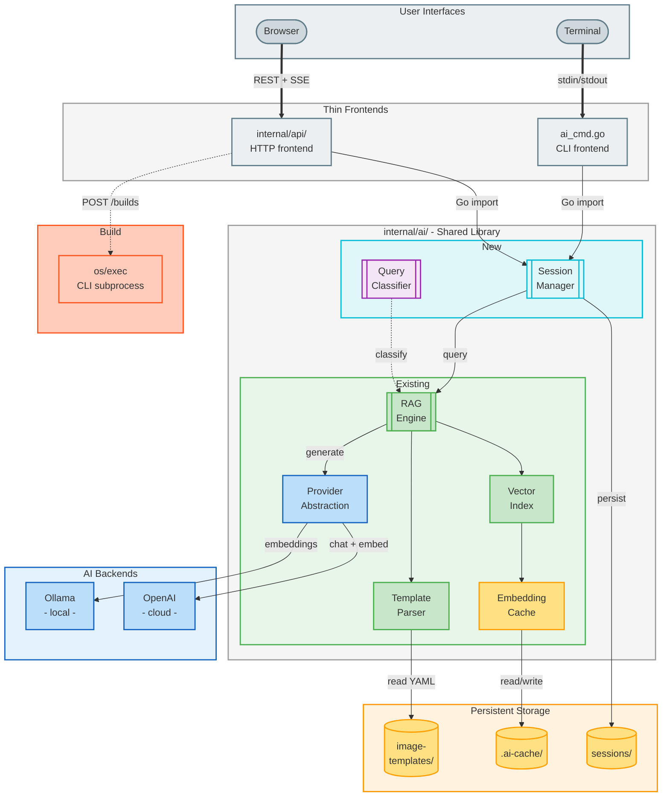
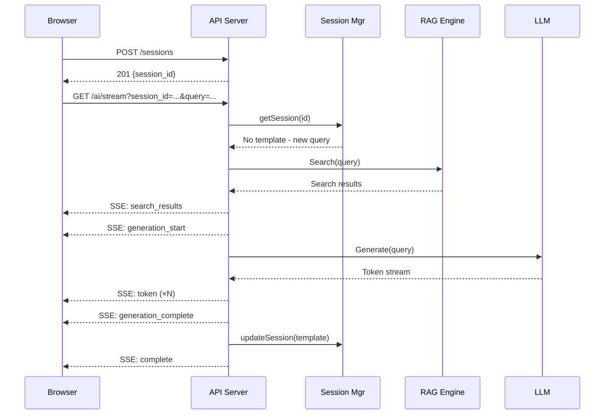
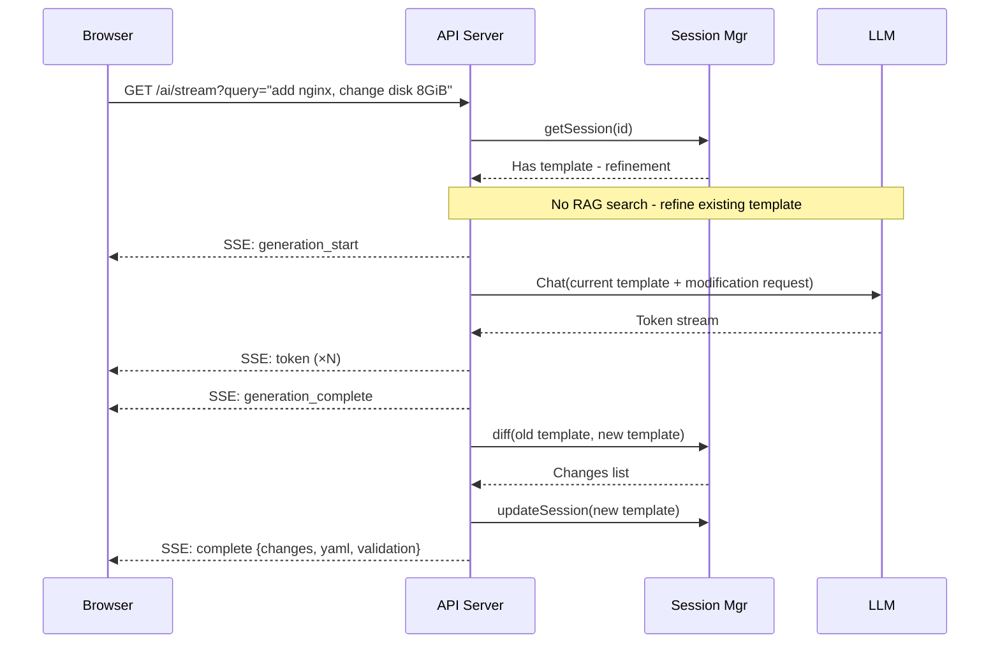
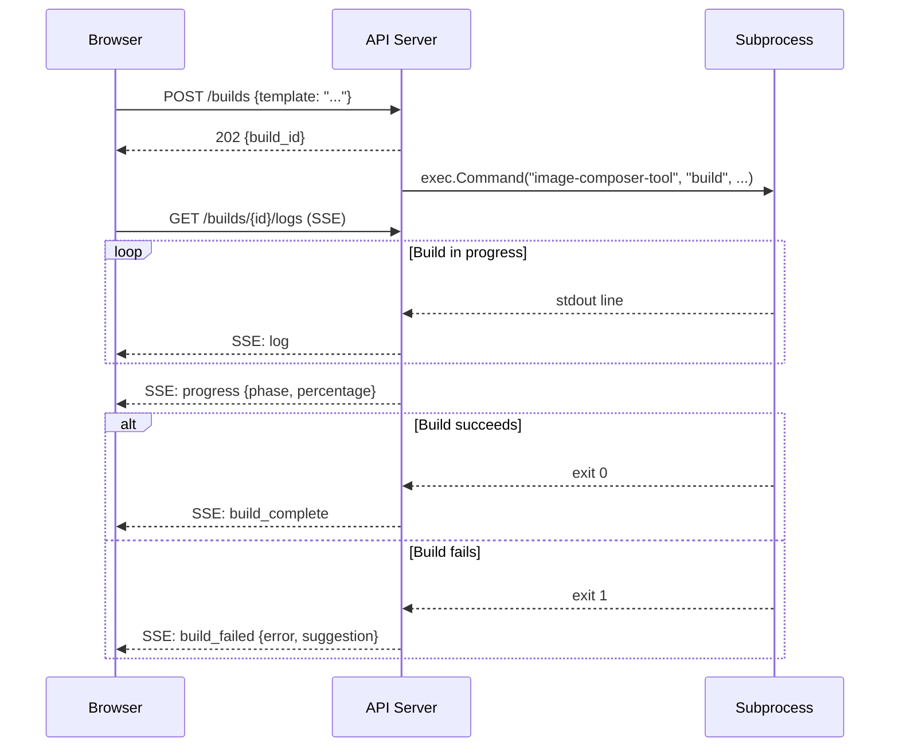
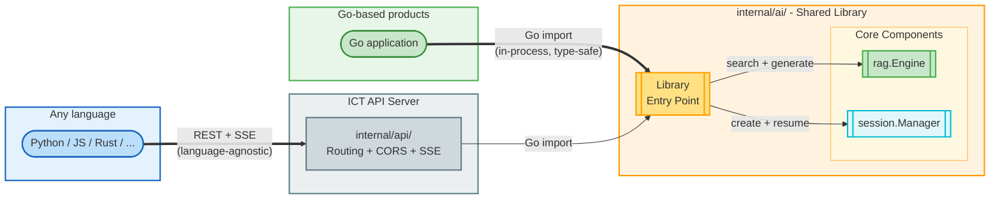

# ADR: Web Interface Architecture for Image Composer Tool

**Status**: Proposed  
**Date**: 2026-05-25  
**Updated**: 2026-06-10  
**Authors**: ICT Team  
**Technical Area**: Web Architecture, API Design  
**Related**: [ADR: Template-Enriched RAG](adr-template-enriched-rag.md)  
**GSoC Project**: [open-edge-platform/projects/42](https://github.com/orgs/open-edge-platform/projects/42/views/2)

---

## Summary

This ADR defines the architecture for a web-based interface to the Image Composer Tool (ICT). The web interface serves two complementary purposes: (1) AI-powered template generation with conversational refinement, and (2) direct template management (create, edit, validate, and build) without requiring AI. The design follows a shared library pattern where new AI capabilities (session management, conversational refinement) are built in `internal/ai/` (the shared Go library) rather than in the web API layer. Both the CLI and web frontends consume the same library, ensuring feature parity and avoiding code duplication. The web API layer (`internal/api/`) is a thin HTTP wrapper handling routing, CORS, and serialization only.

---

## Context

### Problem statement

ICT currently provides AI-powered template generation exclusively through a CLI interface (`image-composer-tool ai "query"`). While effective for developers, this presents barriers to broader adoption:

1. Manual YAML configuration requires deep knowledge of distributions, packages, kernel settings, and disk layouts
2. The CLI offers single-shot generation only, with no iterative refinement through conversation
3. No visual feedback on template structure, validation errors, or build progress
4. No way to browse the existing template library (54 templates) or use one as a starting point

### Background

The RAG engine and AI infrastructure are already implemented in `internal/ai/` (see [ADR: Template-Enriched RAG](adr-template-enriched-rag.md) for details):

| Component | File | Purpose |
|-----------|------|---------|
| RAG engine | `rag/engine.go` | Hybrid scoring: semantic (70%) + keyword (20%) + package (10%) |
| Providers | `provider/provider.go` | Ollama and OpenAI abstraction (embeddings + chat completions) |
| Template parser | `template/parser.go` | YAML parsing with metadata extraction |
| Vector index | `index/index.go` | In-memory cosine similarity search |
| Embedding cache | `cache/cache.go` | Content-hash invalidation, binary vector storage |
| Configuration | `config.go` | Defaults → config.yaml → environment variable precedence |
| CLI | `cmd/.../ai_cmd.go` | Single-shot query, search-only mode, generate + save |

The CLI is a thin 370-line wrapper that calls library functions and formats output for the terminal. The existing library code totals approximately 4,600 lines.

### Requirements

1. Web interface for natural language template generation with streaming responses
2. Multi-turn conversations: generate a template, then refine it iteratively
3. Session persistence: resume conversations after disconnection or restart
4. Visual YAML editor with real-time validation
5. Template library browser with search and filtering
6. Build dashboard with live log streaming
7. CLI must gain the same conversational capabilities (interactive mode, session continuation)

---

## Recommendation

### Recommended approach: Shared library with thin frontends

All new capabilities are implemented in `internal/ai/` (the shared Go library). Both the CLI and web API consume this library directly via Go imports. The web API layer is a thin HTTP wrapper that handles only transport concerns.

### Core design principles

1. **Shared library, thin frontends**: Business logic lives in `internal/ai/`. The CLI and API are presentation layers only.
2. **Single `rag.Engine` instance**: Both frontends share the in-memory vector index and embedding cache, avoiding re-indexing per request.
3. **Session-first design**: Conversation state is managed by a library-level session manager, not the transport layer.
4. **Composition over duplication**: New components (session manager) orchestrate the existing RAG engine. They call `engine.Search()` and `engine.Generate()`, they don't replace them.
5. **SSE over WebSocket**: Server-Sent Events for streaming (token delivery, build logs) because responses are unidirectional and SSE works through corporate proxies.

---

## Diagram Conventions

This ADR follows the same color scheme defined in the [RAG ADR](adr-template-enriched-rag.md):

**Colors**

| Color | Component Type | Fill | Stroke | Examples |
|-------|---------------|------|--------|----------|
| Slate | User Interface / Input | `#ECEFF1` | `#607D8B` | CLI, Browser, User Query |
| Cyan | Session / State Management | `#E0F7FA` | `#00BCD4` | Session Manager |
| Deep Blue | AI / LLM Operations | `#E3F2FD` | `#1565C0` | Embedding API, LLM, Providers |
| Purple | Classification / Analysis | `#F3E5F5` | `#9C27B0` | Query Classifier |
| Green | RAG / Retrieval / Success | `#E8F5E9` | `#4CAF50` | RAG Engine, Validated Output |
| Orange | Agent / Cache / Decisions | `#FFF3E0` | `#FF9800` | Agent Loop, Cache, Sessions |
| Yellow | Warnings | `#FFF9C4` | `#FBC02D` | Return with Warnings |
| Red-Orange | Errors / Fixes | `#FFCCBC` | `#FF5722` | Fix Errors, Build subprocess |

**Node shapes**

| Shape | Mermaid syntax | Meaning | Examples |
|-------|---------------|---------|----------|
| Stadium | `(["..."])` | User entry point | Terminal, Browser |
| Rectangle | `["..."]` | Standard component | CLI frontend, Template Parser |
| Subroutine | `[["..."]]` | Core processing component | RAG Engine, Session Manager |
| Cylinder | `[("...")]` | Persistent storage | image-templates/, .ai-cache/ |
| Diamond | `{"..."}` | Decision / condition | Valid?, All Found? |

---

## High-level architecture



### Why not shell out to the CLI?

The web API imports the Go library directly rather than calling `exec.Command("image-composer-tool", "ai", query)` because:

1. **Cold start**: The CLI re-indexes all 54 templates on every invocation (~5 seconds). The library keeps the index warm in memory.
2. **Streaming**: The library can stream LLM tokens via a callback/channel. The CLI returns only the complete response.
3. **Session state**: Multi-turn conversations require maintaining a `Session` struct across requests. A subprocess can't share memory.
4. **Type safety**: Library calls return Go structs. CLI calls return text that must be parsed.
5. **Overhead**: Process spawn per HTTP request adds ~50ms latency and resource overhead under concurrent load.

### Build subprocess exception

Image builds are the one exception. `POST /api/v1/builds` spawns `exec.Command("image-composer-tool", "build", ...)` as a subprocess because builds require `sudo` privileges, run for minutes, and benefit from process isolation. The API pipes `stdout`/`stderr` over SSE for live log streaming.

---

## New components

### Session manager

**Location**: `internal/ai/session/manager.go`

The session manager maintains conversation state for multi-turn template generation and refinement.

```go
type Manager struct {
    sessions   map[string]*Session
    mu         sync.RWMutex
    timeout    time.Duration
    storageDir string
}

type Session struct {
    ID              string
    CurrentTemplate *GeneratedTemplate
    History         []Message
    CreatedAt       time.Time
    LastActiveAt    time.Time
}

type GeneratedTemplate struct {
    YAML             string
    SourceTemplates  []string
    ValidationStatus string
    LastModified     time.Time
}

type Message struct {
    Role             string    // "user" or "assistant"
    Content          string
    TemplateSnapshot string
    SearchResults    []rag.SearchResult
    Changes          []Change
    Timestamp        time.Time
}

type Change struct {
    Type string // "added", "changed", "removed"
    Path string // YAML path, e.g. "diskConfig.disks[0].size"
    From string
    To   string
}
```

**Key behaviors**:

1. **Refinement detection**: When a session has a `CurrentTemplate`, the manager determines whether a new query is a refinement (modify existing template) or a fresh generation (full RAG search). Refinements skip the RAG search and pass the current template + modification request directly to the LLM.

2. **Session store interface**: Supports both in-memory storage (for the web server) and file-based storage (for CLI session continuation).

```go
type SessionStore interface {
    Get(id string) (*Session, error)
    Put(session *Session) error
    Delete(id string) error
    List() ([]*Session, error)
}

type InMemoryStore struct { ... }   // Web server: fast, concurrent
type FileStore struct { ... }       // CLI: persist to ~/.config/ict/sessions/
```

3. **Lifecycle**: Sessions expire after a configurable timeout (default 30 minutes). A background goroutine cleans up expired sessions. Sessions can be explicitly serialized to disk for later continuation.

### Agent validation loop (future enhancement)

**Location**: `internal/ai/rag/agent.go`

The agent loop will auto-validate every generated template and self-correct if invalid. This is planned as a future enhancement to reduce initial implementation scope. See the [RAG ADR - Lightweight Agentic Capabilities](adr-template-enriched-rag.md) section for the full design including the validation flow diagram, agent tools, and self-correction loop.

When implemented, it will provide:
- Auto-validation of generated templates against the JSON schema
- Self-correction via LLM when validation fails (max 2 attempts)
- Package existence verification against configured repositories
- Streaming of validation steps to the UI via SSE `agent_step` events

### Query classifier (future)

**Location**: `internal/ai/rag/classifier.go`

Full query classification with adaptive scoring weights. This is a future enhancement; the core system works with default scoring weights and session-based refinement detection. See the [RAG ADR - Query Classification](adr-template-enriched-rag.md) section for details.

| Query type | Example | Scoring weights |
|-----------|---------|-----------------|
| Semantic | "cloud image for AWS" | 70/20/10 (default) |
| Package-explicit | "image with nginx and docker-ce" | 40/20/40 |
| Keyword-heavy | "edge IoT minimal raw" | 50/40/10 |
| Negation | "minimal without docker" | Penalize matching templates |

---

## Web API layer

**Location**: `internal/api/`

The API layer is a thin HTTP wrapper. It handles transport concerns only: routing, CORS, JSON serialization, and SSE connection management. No business logic.

### Endpoints

| Method | Path | Purpose | Library call |
|--------|------|---------|-------------|
| `POST` | `/api/v1/sessions` | Create session | `session.Manager.Create()` |
| `GET` | `/api/v1/sessions/{id}` | Get session state | `session.Manager.Get()` |
| `DELETE` | `/api/v1/sessions/{id}` | End session | `session.Manager.Delete()` |
| `POST` | `/api/v1/ai/query` | Submit query | `engine.Generate()` |
| `GET` | `/api/v1/ai/search` | Search templates | `engine.Search()` |
| `GET` | `/api/v1/ai/stream` | SSE: stream tokens | `engine.Generate()` with streaming callback |
| `GET` | `/api/v1/templates` | List templates | `template.Parser` scan |
| `GET` | `/api/v1/templates/{name}` | Get template | `template.Parser.Parse()` |
| `POST` | `/api/v1/templates/validate` | Validate YAML | Existing ICT validator |
| `POST` | `/api/v1/templates` | Create new template | File write + validate |
| `PUT` | `/api/v1/templates/{name}` | Update existing template | File write + validate |
| `DELETE` | `/api/v1/templates/{name}` | Delete template | File remove |
| `POST` | `/api/v1/builds` | Start build | `exec.Command` (subprocess) |
| `GET` | `/api/v1/builds/{id}` | Build status | In-memory build tracker |
| `GET` | `/api/v1/builds/{id}/logs` | SSE: stream build logs | Pipe subprocess stdout |
| `GET` | `/api/v1/engine/stats` | Engine statistics | `engine.GetStats()` |
| `DELETE` | `/api/v1/engine/cache` | Clear cache | `engine.ClearCache()` |

### SSE streaming protocol

Server-Sent Events are used instead of WebSocket because:

1. Responses are unidirectional (server → client); client sends queries via REST POST
2. SSE works through corporate proxies that may reject WebSocket upgrades
3. Native browser `EventSource` API with built-in auto-reconnection
4. No WebSocket library needed on the Go server side, just write to `http.ResponseWriter` with `Content-Type: text/event-stream`

**Event types for `/api/v1/ai/stream`**:

```
event: search_results
data: {"results": [...], "query_type": "semantic"}

event: generation_start
data: {"source_templates": ["elxr-cloud-amd64.yml"]}

event: token
data: {"content": "image:\n"}

event: token
data: {"content": "  name: custom-edge\n"}

event: generation_complete
data: {"yaml": "...", "generation_time_ms": 1850}

event: complete
data: {"session_id": "s_7f3a", "yaml": "...", "validation": {...}, "changes": [...]}

event: error
data: {"code": "GENERATION_FAILED", "message": "LLM timeout", "retry": true}
```

**Event types for `/api/v1/builds/{id}/logs`**:

```
event: log
data: {"timestamp": "...", "level": "info", "message": "Installing docker-ce", "phase": "installing_packages"}

event: progress
data: {"phase": "installing_packages", "percentage": 65}

event: build_complete
data: {"status": "success", "duration_seconds": 390}

event: build_failed
data: {"status": "failed", "error": "Package not found", "suggestion": "Check repository config"}
```

### Router setup

```go
func NewRouter(engine *rag.Engine, sessionMgr *session.Manager, config Config) *http.ServeMux {
    mux := http.NewServeMux()

    // Sessions
    mux.HandleFunc("POST /api/v1/sessions", handleCreateSession(sessionMgr))
    mux.HandleFunc("GET /api/v1/sessions/{id}", handleGetSession(sessionMgr))
    mux.HandleFunc("DELETE /api/v1/sessions/{id}", handleDeleteSession(sessionMgr))

    // AI
    mux.HandleFunc("POST /api/v1/ai/query", handleQuery(engine, sessionMgr))
    mux.HandleFunc("GET /api/v1/ai/search", handleSearch(engine))
    mux.HandleFunc("GET /api/v1/ai/stream", handleStream(engine, sessionMgr))

    // Templates
    mux.HandleFunc("GET /api/v1/templates", handleListTemplates(engine))
    mux.HandleFunc("GET /api/v1/templates/{name}", handleGetTemplate(engine))
    mux.HandleFunc("POST /api/v1/templates", handleCreateTemplate(engine))
    mux.HandleFunc("PUT /api/v1/templates/{name}", handleUpdateTemplate(engine))
    mux.HandleFunc("DELETE /api/v1/templates/{name}", handleDeleteTemplate(engine))
    mux.HandleFunc("POST /api/v1/templates/validate", handleValidate())

    // Builds
    mux.HandleFunc("POST /api/v1/builds", handleStartBuild())
    mux.HandleFunc("GET /api/v1/builds", handleListBuilds())
    mux.HandleFunc("GET /api/v1/builds/{id}", handleGetBuild())
    mux.HandleFunc("GET /api/v1/builds/{id}/logs", handleBuildLogs())

    // Engine
    mux.HandleFunc("GET /api/v1/engine/stats", handleStats(engine))
    mux.HandleFunc("DELETE /api/v1/engine/cache", handleClearCache(engine))

    return withCORS(mux, config.CORS)
}
```

---

## CLI enhancements

The CLI gains conversational capabilities by consuming the same shared library:

```bash
# Existing (unchanged)
image-composer-tool ai "create a minimal edge image for elxr"
image-composer-tool ai --search-only "cloud image"
image-composer-tool ai --clear-cache
image-composer-tool ai --cache-stats

# New: interactive conversation mode
image-composer-tool ai --interactive

# New: resume previous session
image-composer-tool ai --continue
```

Interactive mode uses a terminal REPL loop that calls `session.Manager` for state management and `engine.Generate()` for template generation. Session data is persisted to `~/.config/image-composer-tool/sessions/` via the `FileStore` implementation.

---

## Data flow

### Initial query (web)



### Refinement query (web)



Key difference: refinement skips the RAG search entirely. The session's current template is passed directly to the LLM with the modification request.

### Build flow (subprocess)



---

## Third-party integration

The shared library architecture supports two integration paths for external products that want to embed ICT's AI-powered template generation capabilities.

### Integration paths



### Path 1: Go library import (tightest integration)

Products written in Go can import `internal/ai/` directly as a Go package dependency. This provides:

- Type-safe access to `rag.Engine` and `session.Manager`
- Shared in-memory vector index (no re-indexing)
- Shared embedding cache
- No serialization overhead
- Full control over session lifecycle

```go
import (
    ai "github.com/open-edge-platform/image-composer-tool/internal/ai"
    "github.com/open-edge-platform/image-composer-tool/internal/ai/rag"
    "github.com/open-edge-platform/image-composer-tool/internal/ai/session"
)

func main() {
    engine, _ := rag.NewEngine(ai.DefaultConfig())
    engine.Initialize(ctx)

    sessionMgr := session.NewManager(session.Config{
        Timeout: 30 * time.Minute,
        Store:   session.NewInMemoryStore(),
    })

    sess := sessionMgr.Create()
    result, _ := engine.Generate(ctx, "minimal edge image with docker", sess)
    fmt.Println(result.YAML)
}
```

> **Note**: The `internal/` package path in Go prevents external imports by default. If third-party Go integration becomes a requirement, the packages should be moved to a public path (e.g., `pkg/ai/`) or exposed via a Go module. This is a future decision that does not affect the current architecture.

### Path 2: REST API (language-agnostic)

Products in any language consume the API server as a headless backend:

```python
import requests
import sseclient

# Create session
session = requests.post("http://ict:8080/api/v1/sessions").json()
session_id = session["session_id"]

# Stream a query
response = requests.get(
    "http://ict:8080/api/v1/ai/stream",
    params={"session_id": session_id, "query": "minimal edge image with docker"},
    stream=True
)
client = sseclient.SSEClient(response)
for event in client.events():
    if event.event == "token":
        print(event.data, end="", flush=True)
    elif event.event == "complete":
        result = json.loads(event.data)
        break

# Refine
response = requests.get(
    "http://ict:8080/api/v1/ai/stream",
    params={"session_id": session_id, "query": "add nginx and change disk to 8GiB"},
    stream=True
)
```

### API stability contract

To support third-party consumers, the REST API follows these stability rules:

1. **Versioned endpoints**: All paths prefixed with `/api/v1/`. Breaking changes require a new version (`/api/v2/`).
2. **Additive changes only**: New fields may be added to responses without a version bump. Existing fields are never removed or renamed within a version.
3. **Documented via OpenAPI**: The API specification is published as an OpenAPI 3.0 document at `/api/v1/openapi.json`, enabling automatic client generation in any language.
4. **Stable error codes**: Error `code` strings (e.g., `SESSION_NOT_FOUND`, `GENERATION_FAILED`) are part of the contract and will not change within a version.
5. **SSE event types are stable**: Event names (`token`, `complete`, `error`) will not change within a version. New event types may be added.

### Deployment models

| Model | Description | Use case |
|-------|-------------|----------|
| **Sidecar** | ICT API server runs alongside the product in the same host or pod | Tight coupling, low latency |
| **Shared service** | Single ICT API server shared by multiple products | Multi-tenant, resource efficient |
| **Embedded library** | Go import, no network | Go-only products, maximum performance |
| **Docker Compose** | ICT API + Ollama as containers alongside the product | Development and testing |

---

## Web frontend

### Technology

React single-page application served alongside the Go API server (embedded via `embed.FS` or reverse proxy in development).

### Views

1. **Chat view**: Natural language conversation with streaming responses, search result cards with score breakdowns, syntax-highlighted YAML output, and action buttons (edit, download, build).

2. **Editor view**: CodeMirror/Monaco YAML editor with real-time validation. Validation errors shown inline as editor markers. Debounced calls to `/api/v1/templates/validate`. Works in two modes:
   - **Standalone**: Create new templates from scratch or edit existing templates without AI. Users write or paste YAML directly, get instant validation feedback, and save via `POST /api/v1/templates` or `PUT /api/v1/templates/{name}`.
   - **AI-assisted**: Load AI-generated templates from the chat view for manual refinement before saving.

3. **Template library view**: Card grid of all 54 templates. Filter by distribution, architecture, image type. Detail view showing metadata, package list, disk layout. Actions per template:
   - **Edit**: Open in the editor view for direct modification.
   - **Duplicate**: Create a copy as a starting point for a new template.
   - **Use with AI**: Seed a new chat session with the selected template for AI-driven refinement.
   - **Delete**: Remove a template (with confirmation).
   - **Build**: Send directly to the build dashboard.

4. **Build dashboard view**: Trigger builds from any template (AI-generated or manually created), watch streaming logs, track build history. Error display with suggestions for common failures. Templates do not need to go through the AI flow to be built.

---

## Configuration

```yaml
web:
  host: "0.0.0.0"
  port: 8080
  cors:
    allowed_origins: ["http://localhost:3000"]
    allowed_methods: ["GET", "POST", "DELETE", "OPTIONS"]
  session:
    timeout: 30m
    max_sessions: 100
    cleanup_interval: 5m
    storage_dir: ""              # Empty = in-memory only
  build:
    max_concurrent: 2
    timeout: 30m
    output_dir: /tmp/ict-builds

# ai.agent settings are reserved for the future agent validation feature
# ai:
#   agent:
#     auto_validate: true
#     auto_fix: true
#     max_fix_attempts: 2
#     verify_packages: true
```

---

## Error handling

All API errors follow a consistent format:

```json
{
  "error": {
    "code": "VALIDATION_FAILED",
    "message": "Template validation failed with 2 errors",
    "details": { },
    "request_id": "req_abc123"
  }
}
```

| Code | HTTP | Description |
|------|------|-------------|
| `SESSION_NOT_FOUND` | 404 | Session does not exist or has expired |
| `SESSION_EXPIRED` | 410 | Session timed out |
| `QUERY_REQUIRED` | 400 | No query provided |
| `VALIDATION_FAILED` | 422 | Template YAML is invalid |
| `TEMPLATE_NOT_FOUND` | 404 | Named template does not exist |
| `TEMPLATE_EXISTS` | 409 | Template name already taken |
| `GENERATION_FAILED` | 502 | LLM provider error |
| `PROVIDER_UNAVAILABLE` | 503 | AI provider not reachable |
| `BUILD_FAILED` | 500 | Image build failed |
| `BUILD_NOT_FOUND` | 404 | Build ID does not exist |
| `RATE_LIMITED` | 429 | Too many requests |

---

## Alternatives considered

### Alternative 1: API layer contains business logic

Place session management and query classification in `internal/api/` rather than `internal/ai/`.

**Rejected because**: The CLI would not benefit from these features. Adding `--interactive` mode to the CLI would require duplicating the session management and refinement detection logic. Two implementations of the same logic diverge over time.

### Alternative 2: CLI subprocess for all operations

The web API calls `exec.Command("image-composer-tool", "ai", ...)` for every request instead of importing the library.

**Rejected because**: Each CLI invocation re-indexes all 54 templates (~5 second cold start), cannot share the in-memory vector index, cannot stream LLM tokens, cannot maintain session state across requests, and adds process spawn overhead. This approach is appropriate only for image builds which are long-running operations that need `sudo` and process isolation.

### Alternative 3: WebSocket for streaming

Use WebSocket instead of Server-Sent Events for real-time communication.

**Assessment**: WebSocket provides bidirectional communication, but the streaming use cases in ICT are unidirectional (server → client). Queries are submitted via REST POST; only responses stream back. SSE offers simpler implementation (standard `http.ResponseWriter`), automatic reconnection via the browser `EventSource` API, and better compatibility with corporate proxies. WebSocket remains an option for future features that require bidirectional communication.

### Alternative 4: Separate microservices

Deploy the RAG engine, session manager, and web server as separate services communicating over gRPC or HTTP.

**Rejected because**: ICT is a single-purpose tool, not a platform. Microservice overhead (service discovery, network serialization, deployment complexity) is not justified. A single Go binary with shared library packages provides the same modularity with simpler deployment.

---

## Consequences

### Expected benefits

1. **Feature parity**: Both CLI and web UI get multi-turn conversations and session persistence from the same library code.
2. **Performance**: Single `rag.Engine` instance keeps the vector index warm in memory. No re-indexing per request. Embedding cache shared across all sessions.
3. **Maintainability**: One implementation of session management. Bug fixes and improvements apply to both frontends automatically.
4. **Testability**: Library code is testable in isolation without HTTP infrastructure. Integration tests can exercise the full flow through either frontend.
5. **Deployment simplicity**: Single Go binary. No microservice orchestration. Docker Compose optional for development convenience.
6. **Third-party integration**: External products can integrate via Go import (tightest) or REST API (language-agnostic). The same architecture serves both paths without additional abstraction layers.

### Trade-offs

1. **Shared library complexity**: Adding session management to `internal/ai/` increases the library's surface area. The library must handle concurrent access (web) even though the CLI uses it single-threaded.
2. **Session store abstraction**: Supporting both in-memory (web) and file-based (CLI) storage requires an interface with two implementations, adding indirection.
3. **Go `internal/` path**: The `internal/ai/` path prevents external Go imports by convention. If third-party Go integration becomes a requirement, packages must be relocated to `pkg/ai/`. This is a non-breaking change (same interfaces, different import path) but requires coordination.

### Risks

1. **Scope**: Building shared library features plus web frontend plus CLI interactive mode is substantial. Mitigated by phasing: sessions are critical, agent validation and query classification are future enhancements.
2. **Concurrent state**: The session manager must be thread-safe for the web server. Mitigated by standard Go concurrency patterns (`sync.RWMutex`).
3. **LLM latency**: Streaming helps perceived performance but doesn't reduce actual generation time. Mitigated by embedding cache (fast retrieval) and SSE (early content delivery).

---

## Observability

**Logging should include:**

- Session lifecycle events (created, expired, resumed, deleted)
- Refinement detection decisions (new query vs. refinement, and why)
- SSE connection lifecycle (connect, disconnect, reconnect)
- Build process lifecycle (started, progress, completed, failed)
- API request latency by endpoint

**Metrics to track:**

- Session count (active, expired, persisted)
- Refinement ratio (refinements vs. new queries per session)
- Build success rate and average duration
- SSE connection count and duration

---

## Implementation phases

Week 1 is the GSoC community bonding / onboarding period. Development starts at Week 2.

**Phase 1: Project setup and API foundation (Weeks 2-3)**
- Project scaffolding: `internal/api/` package, router, CORS middleware
- REST API endpoints for templates (list, get, create, update, delete, validate)
- REST API endpoints for AI query and search
- Basic request/response JSON serialization and error handling

**Phase 2: SSE streaming and chat backend (Weeks 4-5)**
- SSE streaming infrastructure for LLM token delivery
- `POST /api/v1/ai/query` and `GET /api/v1/ai/stream` implementation
- Connect API to existing `rag.Engine` for search and generation
- Basic chat UI with streaming responses and template display

**Phase 3: Session manager and conversations (Weeks 6-7)**
- Session manager in `internal/ai/session/`
- `SessionStore` interface with in-memory and file-based implementations
- Refinement detection: new query vs. modify existing template
- Multi-turn conversation flow in chat UI
- Session persistence for CLI `--interactive` and `--continue` modes

**Phase 4: Template editor and library browser (Weeks 8-9)**
- Visual YAML editor (CodeMirror/Monaco) with real-time validation
- Standalone mode: create and edit templates without AI
- AI-assisted mode: load AI-generated templates for manual refinement
- Template library browser with filtering by distribution, architecture, image type
- Template actions: edit, duplicate, delete, use with AI

**Phase 5: Build integration (Weeks 10-11)**
- Build trigger via subprocess (`exec.Command`)
- Build log streaming via SSE
- Build dashboard with history and status tracking
- Error display with suggestions for common failures

**Phase 6: Polish, testing, and documentation (Week 12)**
- End-to-end testing of all flows (AI generation, manual editing, builds)
- UI polish and error handling improvements
- Documentation updates: usage guide, API reference
- Final PR cleanup and code review

**Future enhancements (post-GSoC)**
- Agent validation loop (auto-validate, self-correct, verify packages)
- Query classification with adaptive scoring weight profiles
- Negation handling in search queries

---

## References

- [ADR: Template-Enriched RAG](adr-template-enriched-rag.md) - RAG architecture, query classification, hybrid scoring
- [Server-Sent Events specification](https://html.spec.whatwg.org/multipage/server-sent-events.html)
- [Go `net/http` ServeMux routing](https://pkg.go.dev/net/http#ServeMux)

---

## Revision history

| Date | Author | Change |
|------|--------|--------|
| 2026-05-25 | ICT Team | Initial draft |
| 2026-06-10 | ICT Team | Added to repository; fixed diagram rendering; aligned format with RAG ADR |
| 2026-06-11 | ICT Team | Expanded template management to cover non-AI workflows; added PUT/DELETE template endpoints |
